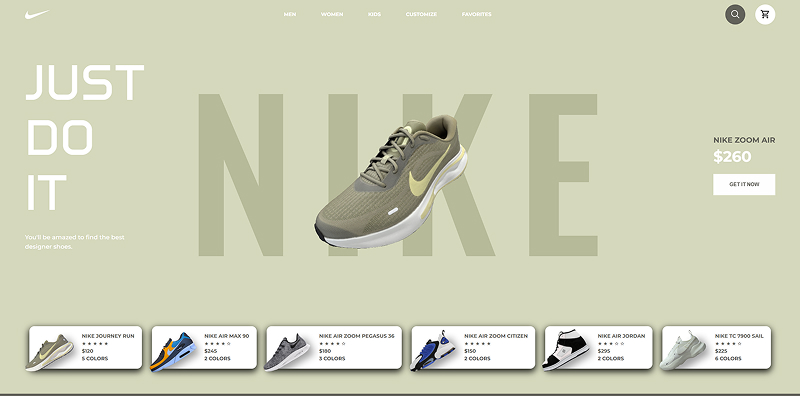

# sneaker-shop
Project to learn implementing ThreeJS model mixed with HTML template... (Work in progress)<br> 
[Demo link](https://qluback-sneaker-shop.netlify.app/)



3D Models from :
[Lassi Kaukonen](https://sketchfab.com/3d-models/nike-journey-run-4c7c6acd57c347058f91ca71ec6c379b)<br> 
[mercurio22](https://sketchfab.com/3d-models/nike-air-max-90-premium-4b2280c16b67481cba0fe7ffacd77011)<br> 
[quaz30](https://sketchfab.com/3d-models/nike-air-zoom-pegasus-36-00fd99e778c244c3bd3b65f99dad7cb2)<br> 
[NIKE](https://sketchfab.com/3d-models/nike-journey-run-4c7c6acd57c347058f91ca71ec6c379b)<br> 
[SofiaWolfie](https://sketchfab.com/3d-models/nike-journey-run-4c7c6acd57c347058f91ca71ec6c379b)

## Setup
Download [Node.js](https://nodejs.org/en/download/).
Run this followed commands:

``` bash
# Install dependencies (only the first time)
npm install

# Run the local server at localhost:8080
npm run dev

# Build for production in the dist/ directory
npm run build
```
